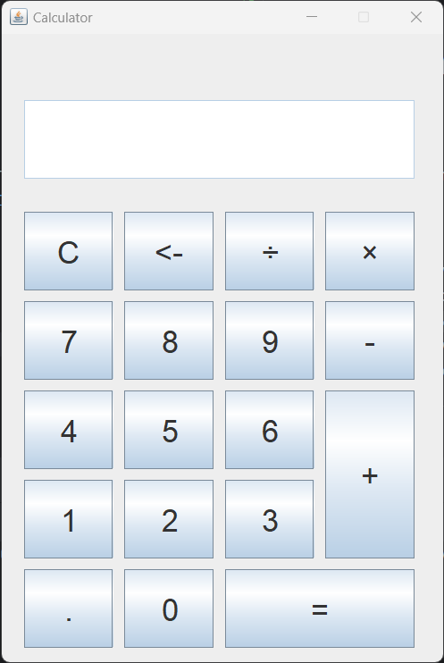

# CALCULATOR

### Requirements 
- Java 11 or higher.

### Installation 
1. Press **Fork** to save copy of this project.
2. Download the repository files by typing in the bash the following command:
 `git clone https://github.com/artemelyashevich/calculator.git`
3. Imported it in Java IDE.
4. Run the application.

***
### Screenshot

